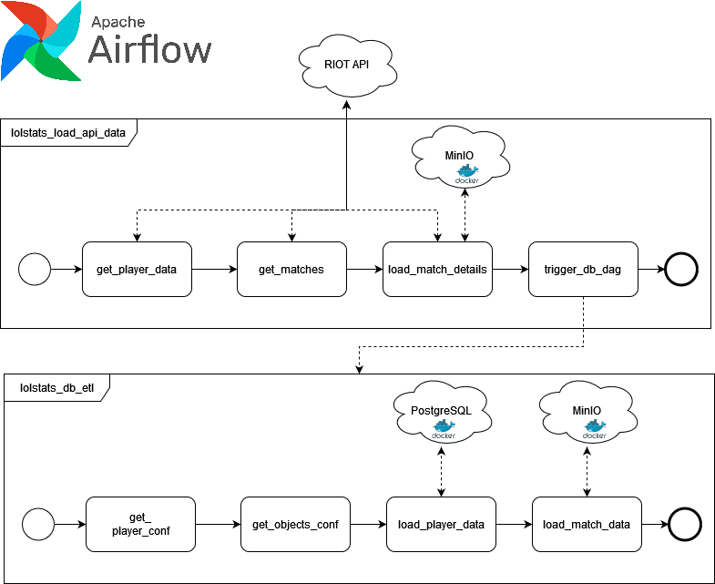

# LoLStats
Personal weekend project to demo usage of airflow using the new taskflow api.
Uses `Airflow`, `MinIO` and `PostgreSQL`, as well as `PGAdmin`, `SQLAlchemy` and the RIOT API (https://developer.riotgames.com/)

## Overview

## (Basic) Analysis Examples
### Damage Stats by Player by Game

### AVG Damage dealt by Damagetype

### Avg. K/D/A by Role

### Avg. Gold earned vs Gold Spend

